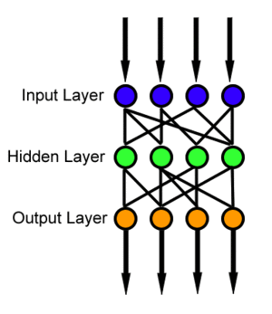
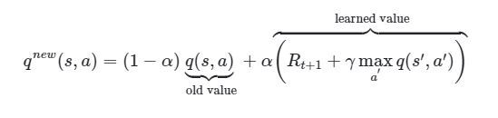
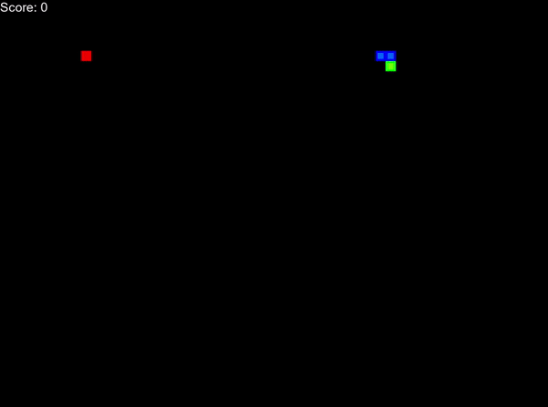
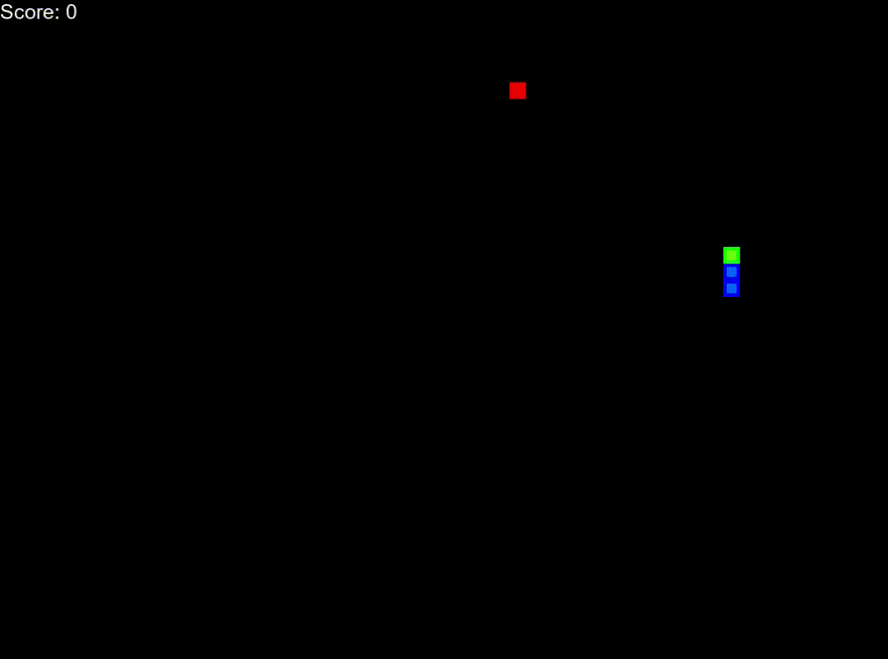

## Snake Game

#### Coding of the AI
Now we can get started with the coding the actual AI.

We will implement the AI using a neural network. There are several kinds of networks we can use for this task. We will use a simple form of network called a Feedforward nural network.

It means that we construct a network where the nodes never form a circle. We pass in data in one end, into something that is called input nodes. The passes through the network layers and gives us an output at the other end.

We will form a network consisting of three layers. 

The input layer is formed by 11 nodes. The reason there are 11 nodes is that we will use an input that conosist of 11 values. 
We will soon come to why we ended up with 11 values.

The output layer will consist of three nodes. The reason for this is that what we need from the AI is an action, and as we saw in the previsous branch play_step_ai wants an input consisting och three values.

This is an illustration of a feedforward network.

As we can see, the information moves only in one direction. We can also see that betwen the input and output layer is a hidden layer. We can exepriment with the number of nodes in this layer to find something that works for our task. We are not limited to just three layers either, we can, if we want, add more hidden layers to our network.

### Forming the Input Data
The data that we will feed the network with is some information about the state of the game after each step. 

This will consist of 11 zeros and ones. We will not tell the network the meaning of these values. It will need to figure that out by itself.

The input data will consist of three parts.

##### Danger Path
The first three values represents if a move in a given direction will result in death of the snake.

A 1 represents death if we move in that direction and 0 that this move is safe.

If the snake is moving to the left and it's head is just one tile from the left wall, a move straight ahead would mean death. So if there is a 1 in the first location it represent that we will die if we move forward in the direction we currently moving in.

The second value will tell us the result of right turn, and the third value the result of a left turn.

Here are some combinations of these first three values as an example:

0, 0, 0 = All directions are safe
1, 0, 0 = Right and left are safe but straight ahead will kill the snake
1, 0, 1 = Straight and a left turn will kill the snake, but a right turn is safe
1, 1, 0, = Straight and a right turn will kill the snake, but moving to the left is safe
1, 1, 1 = You are screwed

##### Current Direction
The next four values represents the current direction.
Only one of these can be 1 at any given time. The order of the values are:

left, right, up, down

so the combination

0, 1, 0, 0

mean that the snake is traveling to the right

0, 0, 1, 0

mean that the snake is heading up.

##### Fruit Location
The last 4 values represents where the fruit is located in relation to the head of the snake. It is not an exact location. The first two values tells us if the fruit is to the left or to the right. The last two values tells us if the fruit is above or below us.

Some examples

1, 0, 0, 1 = The fruit is to the left and below us
0, 0, 1, 0 = We are in the same column as the fruit but it is above us
0, 1, 0, 0 = We are on the same row as the fruit but it is to our right.

###### All Values Together
If we put all these values together we can get something like this

[1, 1, 0,
 0, 1, 0, 0,
 1, 0, 1, 0]

 As we can see, we got 11 values. These can be interpreted as:

 You will die if you move straight ahead or turn to the right, but turning left is OK. (First three values)

 You are currently moving in the right direction. (Next four values)

 The fruit is to your left and above you. (The last four values)

 We know the meaning of these values, but the AI don't.

 #### Long and Short Memory
 The AI will also work with something that is called a long and short memory.

 The short memory is just the last step is took. The long memory is a number of previsous steps, up to a limit that we set. We will use up to a maximum of 1,000 steps prior to where we are now.

 The network will "replay" the last step it took to evaluate the outcome of it's action. We will tell it the outcome of that move (death or no death) and the reward we got from that move.

 We will also store each move and its outcome in the long memory.

 When the snake dies it will replay all moves in the long memory and learn from it.

 ### The AI Game Loop
 If we explore the game loop for the AI player we will get a better idea what is happening.

 ##### 1. Current State
 The first thing we need to do is to get the current state of the game.
 
 The state is represented by the elven values we saw above that tells us what will happen if we take one step in the direction we are heading, if we turn right or left, the current direction, and the position of the fruit in relation to the snake's head.

  #### 2. Decide the Next Move
  Next, we will get the next move. This will done in one of two ways. 

  To make the model envolve in a good way we will need to give it the abillity to mutate. This is done by giving it a chance to do a totally random move.

  The chance of this random move is controlled by something that is called the epsilon. We are using a constant value and subtract the number of games played from it. If a random value is below the epsilon we will make a totally random move.

  In our case we will use 80 as our epsilon constant, meaning that the first 80 games will have an element of randomness in it. After 80 games all moves are decided by the AI.

  ###### The AI Move
  When we want the AI to decide on it's move we will do three things. 

  First, we will transform the state, that is a Python list of integers, into a tensor.

  There is nothing magical about a tensor. It is a n-dimensional array, but it is in a form that works with our next step, predicting the step.

  The prediction is done by calling the model, passing the state tensor.

  This call will activate the models forward method. This method is responsible for passing the data through the network layers.

  Our state tensor is passed to the input layer and the output is then passed to a *rectified linear activation function*, or ReLU for short.

  If you want to learn more what it is and how it works you can read more this [blog post](https://machinelearningmastery.com/rectified-linear-activation-function-for-deep-learning-neural-networks/) by Jason Brownlee. 

  If the output from the first layer has a tensor that begins something like this

  `[ 
    2.5215e-01, -9.9852e-02,  5.0063e-01, -4.6104e-01,  2.7466e-01,
    2.4340e-01,  2.5108e-01, -9.9582e-01,  3.6498e-01, -1.5200e-02,
    ...
  ]`

  it will look like this after passing the ReLU function
`[2.5215e-01, 0.0000e+00, 5.0063e-01, 0.0000e+00, 2.7466e-01, 2.4340e-01,
        2.5108e-01, 0.0000e+00, 3.6498e-01, 0.0000e+00, 4.5091e-01, 1.6249e-01, ...]`

As we can see, all positive values are left untouched, but the negative values has been replaced by zeros.

After passing that data into the last layer of our network we will get a tensor that looks something like this

`[0.0932, -0.0117, 0.1034]`

We get three values as we asked for an output layer of size 3.

We will use the index to the largest of these values to decide on the move.

Remeber that our move is a list of three values, 2 zeros and 1 one. The position of the single digit 1 tells us the move.

In the example above, the last value is the largest, so we transform this into our move list, in this case it will be

`[0, 0, 1]`

So, in this case, the next move will be a turn to the left.

#### 3. Move the Snake
Now that we have an action for the snake we pass the list of three values to the play_step_ai method in the game class.

When that move is over we need to evaluate the outcome.

#### 4. Training the AI
Not much training is done during a game. The main part is done after a game is finished.

But to be able to to any training we need to gather some data. We already have some of it, the state of the game before the move was made, the return values from play_step_ai (that was if we survived that move or not, the reward we got from that move, and the current score). 

But we need to see what the state of the game is after the move too. We do that by gathering the same 11 values we got before the move.

All this data, except for the score is then passed to method called train_step in a class we call QTrainer.

This is where the training takes place. 

The initial state (the state before the move), the action (that is the move decided on by the AI), the reward, and the state after the move are all transformed into tensors.

This method is used to train both the short and the long memory of the AI. If we train the long memory we will get up to 1,000 of these states, actions and rewards. But if we train the short memory we will get only one of each of these values. 

If we are working with a batch of samples to train they will be in the form (n, values), but if we work with a single sample, that is if we train the short memory, we need to reshape the data so it is in the form (1, value). This is done done by passing the tensor to a function called unsqueeze. We pass a 0 to the unsqueeze function and that will add one dimension to the beging of the tensor (the 1 that we see above).

We are now ready to do some learning.

##### Deep Q Learning
The Q in Deep Q Learning represents the quality of the action.

What we want to do is to improve the quality of the snake, by improving it's Q value.

We will build the learning, that is improving the Q value, on the Bellman Equation. It looks like this

We will not use it as it is, but instead we will simplyfy it to suit our needs.

Our simplyfied rule will be

Qold = model.predict(state0)

Qnew = R + Ɣ * max(Qold(state1))

state0 is the old state
R is the reward
Ɣ is a gamma value. This is a value we define as a value between 0 and 1. We can exeperement with this value if we want.
state1 is the state after the move.

This mean that we predict the outcome of a move, multiply the gamma value with the index of the maximum value in the new state. 

The new state is the output from our neural network, the three values that decided if we want to move straight, to the right or to the left, so the index we get is just to decide what the next move would be.

The value we get from this multiplacation is then added to the reward given for this move. This will be our new Q value.

##### Loss Function
To understand if our prediction is a good or bad one, we need the help of a loss function. 

The loss function we will use is called Mean Squared Error (MSE). 

Before we calculate the loss, we need to apply an optimizer function. The optimzer function will use the gradient information in our network. To get a better understanding of what gradients are and how they work we can again turn to Jason Brownlee and his [blog](https://machinelearningmastery.com/gradient-in-machine-learning/).

We have a wide selection of optimizer functions to choose from, and here we are using the Adam Optimization Algorithm. Want to know what that is? Well here Jason again, with another post on [that topic](https://machinelearningmastery.com/adam-optimization-algorithm-for-deep-learning/).

We can now apply our loss function to see how we performed. We are using the MSE algorithm. In short, what it does, is that meassure the average of squares of the errors - that is, the average squared difference between the estimated value and the actual value. 

To take a very simplified example. If I predict the temperature for to tomorrow to be 12 ℃ and the actual temperature turns out to be 15 ℃ the error is 3. If we have a number of predictions we calculate the the average of these errors, and that will give us an indication of how well we are doing.

As this is a feedforward neural network we will then do something that is known as backpropagation. A very simplyfied explanation of what this is would be to say that this is the step that computes the gradients (in something that is known as the weight space) of the network. This is a step we need to perform, even if we not fully understand it.

We can now let the optimizer do the optimization of the network, and we do that by asking the optimizer to take a step.

When we are done with the training of the short memory, the only thing we need to do is to store the data 
(the current state, the final action, the reward, the new state and if we died or not) in the long memory.

##### When the Snake Dies
When the game is over, we will perform some final steps. Except from reseting the game and start over we need to train the long memory. This is when we play back up to 1,000 previsous moves and the result of them and learn from them. We will use the same train method as we used for the trainging of the short memory for this, but this time on many more steps.

### Running the AI
If we now run the ai_snake application, we will see that during the first games it is really crappy at this.

But after about 90 games we can see a great improvement.

It is still not perfect, and it will never be. The reason for this is that the AI only knows about its head and the location of the fruit, but is totally unaware of its body. After the first 90-100 games the AI will be as good as it can ever be, and there will be only one way it can die and that is that it will trap its head with its body and have no way out.

### The Final Game
In this branch you will find the new files (model.py for the network model code, agent.py that will drive the network) with some method that are empty. There is also a plot.py that contains some code that we can use to plot our results to a graph. You can either try to code these yourself, or if you are lazy you can checkout the **final_ai** branch to get a working example of how this can be done.
